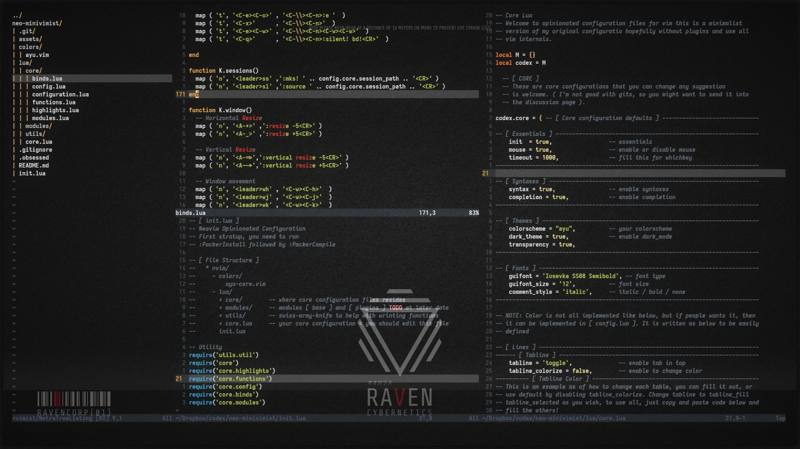

# NEO-MINIVIMIST

**Minimal and Beautiful ( on-progress ) Neovim config!**

This is an opinionated config/dotfiles for neovim beginners. Since Neovim is
migrating most of its configuration to lua, people might want to see what can
be done with lua based configuration. This configuration doesn't include
plugins, you might want to install it using plugin managers ( packer and paq
are recommended).





Inspired by projects like [doom-nvim](https://github.com/NTBBloodbath/doom-nvim)
(I'm going back and forth between emacs and nvim, and now this!?),
[LunarVim](https://github.com/ChristianChiarulli/LunarVim),
[nvim_like_me]( https://github.com/christopher-besch/nvim_like_me ). These
project has done much to help me with understanding how lua works, especially
their codebase. You might find some resemblance to these project, since those are
turned into a minimal neovim config (not super minimal, but okayish).

**NOTE:** your config is inside lua folder, named **core.lua** remember that!

`Maxivimist` version will be published at later date once it complete.

## Installation

There are multiple folders for each, you might want to change
`neo-minivimist` to other `nvim` or you can link it, I choose the latter, since
it is easier to unlink it afterwards.

**READ THIS FIRST!**: please make **backups** before you do this!

``` bash
mv ~/.config/nvim ~/.config/.pre_neo-minivimist && \
  git clone https://github.com/archaict/neo-minivimist ~/.config/neo-minivimist
```

Copy and paste command below to link it ( recommended ), you can unlink it
later by using `unlink ~/.config/nvim`.
``` bash
ln -srf ~/.config/neo-minivimist ~/.config/nvim
```

To restore your vim configuration, you can use commands below:
``` bash
unlink ~/.config/nvim # to unlink nvim
rm ~/.config/neo-minivimist # to remove neo-minivimist
mv ~/.config/.pre_neo-minivimist ~/.config/nvim # to restore your nvim
```

## Folder Structure

There are three core folders ( inspired by
[doom-nvim](https://github.com/NTBBloodbath/doom-nvim)! )
that resides inside `lua` directory.

- **lua/core.lua** is your primary **config** file!
- **core** consists of base configuration
- **modules** where the core plugins resides
- **utils** the utility command, taken from
[nvim_like_me]( https://github.com/christopher-besch/nvim_like_me )

```
neo-minivimist/
| .git/
| colors/
| lua/
| | core/
| | | binds.lua
| | | config.lua
| | | configuration.lua
| | | functions.lua
| | | highlights.lua
| | | modules.lua
| | modules/
| | | base/
| | | | abolish.vim
| | | | commentary.vim
| | | | endwise.vim
| | | | eunuch.vim
| | | | flagship.vim
| | | | netrw.lua
| | | | repeat.vim
| | | | speeddating.vim
| | | | surround.vim
| | utils/
| | | util.lua
| | core.lua
| README.md
| init.lua
```
As you can see, there are still much room for improvements!

**NOTE:** **Base** are sourced from [tpope](https://github.com/tpope) plugins,
not much else as you can see, although there is a wild `netrw.lua` threw
inside this directory!

Enjoy!

Thanks to:
- [LunarVim](https://github.com/ChristianChiarulli/LunarVim)
- [doom-nvim](https://github.com/NTBBloodbath/doom-nvim)
- [nvim_like_me]( https://github.com/christopher-besch/nvim_like_me )
- [tpope](https://github.com/tpope)
- [ayu-themes/ayu](https://github.com/ayu-theme/ayu-vim)
